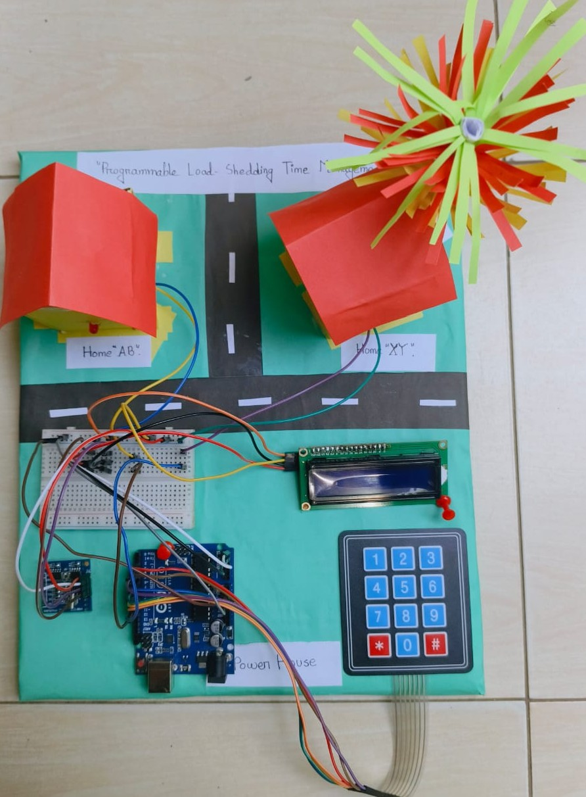

# Programmable Load Shedding Time Management System

A mini embedded system project to automate and manage load shedding schedules using Arduino Uno, RTC DS1307, Keypad, and LCD.

---

## 🔧 Hardware Used

- Arduino Uno R3
- RTC DS1307 (Real-Time Clock)
- 4x3 Keypad
- 16x2 LCD with I2C
- Red and Green LEDs
- Jumper Wires and Breadboard

---

## 🖥️ Software & Libraries

- **Arduino IDE**
- Libraries:
  - `Wire.h`
  - `LiquidCrystal_I2C.h`
  - `Keypad.h`
  - `RTClib.h`

---

## 📌 System Features

- Set Start and End time for load shedding using Keypad.
- Real-time monitoring using RTC.
- LCD displays current time and system status.
- Red LED indicates power cut (load shedding active).
- Green LED indicates normal power (no shedding).

---

## ⚙️ Algorithm

1. Initialize LCD, RTC, Keypad, LEDs.
2. Prompt user to enter start time (hour and minute) via keypad.
3. Prompt user to enter end time (hour and minute).
4. Continuously read current time from RTC.
5. If current time is between start and end time:
   - Turn ON Red LED
   - Turn OFF Green LED
   - Display "Load Shedding" message
6. Otherwise:
   - Turn ON Green LED
   - Turn OFF Red LED
   - Display "Normal Power" message
7. Repeat steps 4–6 in loop.

---
## 💻 Arduino Code

You can find the full source code here:  
➡️ [Click to View Code](Arduino_Code/load_shedding.ino)

---

## 📸 Screenshot

> Replace `images/screenshot.jpg` with your actual screenshot image path. Upload the image to your GitHub repo.

---

## 🧪 How It Works

1. User sets load shedding Start and End time.
2. The system continuously checks current time from RTC.
3. If current time is within the set range, Red LED turns ON.
4. Outside the range, Green LED turns ON.

---

## 📄 Project Report

Full report is available in the `docs/` folder: [Project_Report.pdf](docs/Project_Report.pdf)

---

## 🚀 Future Improvements

- Add Bluetooth/Wi-Fi module for remote access.
- Build mobile app for schedule setup.
- Add logging and energy usage analytics.
- Expand for multi-phase/grid scale management.

---

## 📜 License

MIT License *(optional)*

---

**Project Team:**
- Md Naimur Rahman  
- Md. Shohanur Rahman  
- Shuvo Singh Partho  
- Mahafuzur Rahaman Bappy  
- Md. Arafat Hossain  

**Supervisor:** Ms. Rimi Akter, Lecturer, DIU
